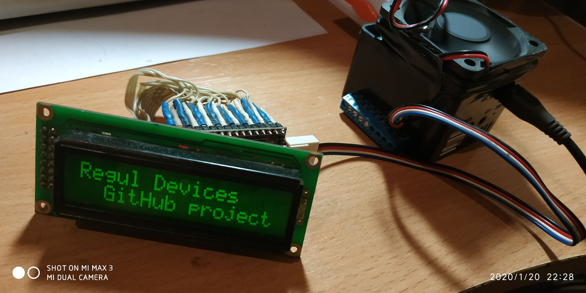

# i2c-lcd.sh
Control i2c-LCD1602 via web interface (CGI).

i2c LCD 1602 connect to OrangePI

HowTo:
1) Create new user group called i2c:
    #sudo groupadd i2c

2) Change the group ownership of /dev/i2c-N to i2c:
    #sudo chown :i2c /dev/i2c-N

3) Change the file permissions of the device /dev/i2c-N so users of the i2c group can read and write to the device:
    #sudo chmod g+rw /dev/i2c-N

4) Add CGI user (www-data) to the group i2c:
    #sudo usermod -aG i2c www-data

5) After you logout and login again you should be able to run i2cdetect -y N.

The listing blow shows an example output of the command. As one can see, I connected three I2C devices to my Orange Pi Zero.
    #sudo -u www-data "i2cdetect -y N"

     0  1  2  3  4  5  6  7  8  9  a  b  c  d  e  f
00:          -- 04 -- -- -- -- -- -- -- -- -- -- -- 
10: -- -- -- -- -- -- -- -- -- -- -- -- -- -- -- -- 
20: -- -- -- -- -- -- -- -- -- -- -- -- -- -- -- -- 
30: -- -- -- -- -- -- -- -- -- 39 -- -- -- -- -- -- 
40: -- -- -- -- -- -- -- -- -- -- -- -- -- -- -- -- 
50: -- -- -- -- -- -- -- -- -- -- -- -- -- -- -- -- 
60: -- -- -- -- -- -- -- -- -- -- -- -- -- -- -- -- 
70: -- -- -- -- -- -- -- 77

6) Lastly, we need to make the changes permament, so we don't need to repeat them on every reboot.
    #su root

Next, create a udev rule file as shown below:
    #echo 'KERNEL=="i2c-[0-9]*", GROUP="i2c"' >> /etc/udev/rules.d/10-local_i2c_group.rules

7) Edit lcd.cgi script
    i2c_adres=0x3f
		|
		L_______you lcd i2c addr

8) Put lcd.cgi script to you server../cgi-bin
    Open browser and go to link:
    http://you_website/cgi-bin/lcd.cgi?str=blablabla

Russia, Krasnoyarsk 2020
